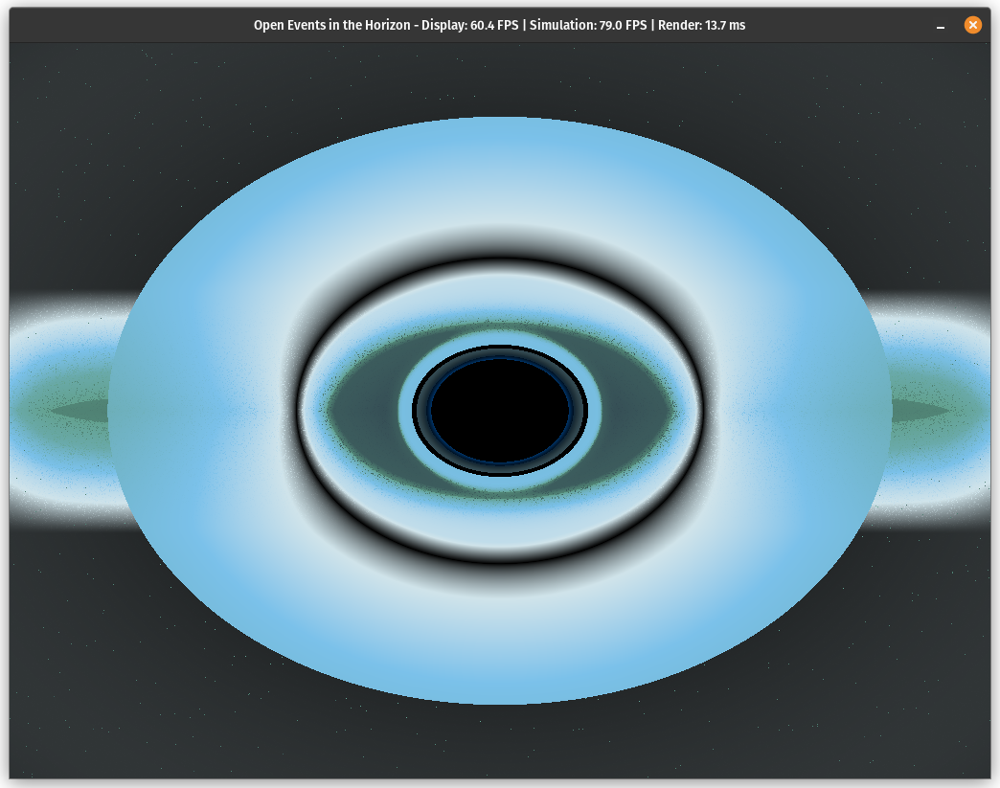

# Open Events in the Horizon (OEH)



A physically accurate, GPU-accelerated black hole visualization based on magnetically dominated accretion disk physics.

## Overview

Open Events in the Horizon (OEH) is a high-performance black hole simulation that renders scientifically accurate visualizations of black holes and their accretion disks. The simulation implements a magnetically dominated accretion disk model based on the research by Pariev, Blackman & Boldyrev (2003), extending the standard Shakura-Sunyaev approach to account for strong magnetic field effects.

### Key Features

- **Physically Accurate Physics**: Implements relativistic light bending in Schwarzschild geometry
- **Magnetically Dominated Disk Model**: Based on peer-reviewed astrophysical research
- **High-Performance Rendering**: CUDA-accelerated ray tracing for real-time visualization
- **Interactive Camera Control**: Explore the black hole from different perspectives
- **Advanced Post-Processing**: Realistic visualization with exposure, contrast, and bloom effects
- **Multiple Integration Methods**: Choose between Euler, RK4, and Velocity Verlet integrators

## Scientific Foundation

This simulation implements the magnetically dominated accretion disk model described in:

> Pariev, V. I., Blackman, E. G., & Boldyrev, S. A. (2003). **Extending the Shakura-Sunyaev approach to a strongly magnetized accretion disc model**. *Astronomy & Astrophysics, 407*, 403-421. [https://www.aanda.org/articles/aa/full/2003/32/aa3695/aa3695.right.html](https://www.aanda.org/articles/aa/full/2003/32/aa3695/aa3695.right.html)

The model accounts for the effects of magnetic pressure exceeding thermal/radiation pressure in the disk, producing a distinct temperature profile and emission spectrum compared to standard accretion disk models.

## Requirements

- Python 3.12
- NVIDIA GPU with CUDA support
- OpenGL 3.3+ compatible graphics hardware

## Installation

OEH uses [UV](https://github.com/astral-sh/uv) for package management. To install:

1. Make sure you have UV installed:
   ```bash
   pip install uv
   ```

2. Clone the repository:
   ```bash
   git clone https://github.com/ericsonwillians/oeh.git
   cd oeh
   ```

3. Install dependencies with UV:
   ```bash
   uv pip install -e .
   ```

4. For development dependencies:
   ```bash
   uv pip install -e ".[dev,lint]"
   ```

## Usage

Launch the simulation:

```bash
uv run -m oeh.main 
```

### Controls

- **W/A/S/D**: Move camera position
- **Arrow Keys**: ↑↓ adjusts black hole mass, ←→ adjusts field of view
- **Space**: Pause/resume simulation
- **B/N**: Decrease/increase magnetic field exponent
- **1/2/3**: Switch between integration methods (Euler, RK4, Velocity Verlet)
- **Q/E**: Increase/decrease exposure
- **C/V**: Adjust contrast
- **G/T**: Adjust gamma
- **F**: Toggle vignette effect
- **R**: Toggle auto-rotation
- **P**: Take screenshot
- **H**: Toggle help display
- **I**: Toggle information display
- **0**: Reset all parameters to defaults
- **ESC**: Exit

## Architecture

The project is organized into several modules:

- `oeh.cuda`: CUDA kernels for ray tracing computation
- `oeh.rendering`: OpenGL rendering pipeline and shader management
- `oeh.simulation`: Physics simulation including integrators and ray tracers
- `utils`: Helper utilities and logging

## Technical Details

### Physics Implementation

The simulation implements:

1. **Realistic Light Bending**: Approximated Schwarzschild geometry using the Paczynski-Wiita potential
2. **Magnetically Dominated Accretion Disk**: Non-standard temperature profile based on magnetic pressure support
3. **Relativistic Effects**: Includes Doppler shifting and gravitational redshift
4. **Multiple Integration Methods**: Euler, RK4, and Velocity Verlet for ray tracing
5. **Realistic Emission Spectrum**: Temperature-dependent blackbody emission with corrections for electron scattering

### Rendering Pipeline

The visualization pipeline includes:

1. GPU-accelerated ray tracing using CUDA
2. OpenGL-based rendering with advanced shaders
3. Post-processing effects including HDR, bloom, and vignette
4. Color mapping based on physically accurate temperature profiles

## Development

For development:

1. Install development dependencies:
   ```bash
   uv pip install -e ".[dev,lint]"
   ```

2. Run tests:
   ```bash
   pytest
   ```

3. Lint code:
   ```bash
   ruff check .
   ```

## Acknowledgments

This project was made possible with the assistance of:

- Claude Sonnet 3.7
- Gemini Pro 2.0 Experimental
- OpenAI GPT-o3 mini-high

Their capabilities for code generation, scientific research understanding, and optimization suggestions were invaluable.

## License

This project is licensed under the GNU General Public License v3.0 - see the [LICENSE](LICENSE) file for details.

## Citation

If you use this software in your research, please cite:

```bibtex
@software{willians2025oeh,
  author = {Willians, Ericson},
  title = {Open Events in the Horizon: A GPU-accelerated Black Hole Visualization},
  year = {2025},
  url = {https://github.com/ericsonwillians/oeh}
}
```

And the original research paper:

```bibtex
@article{pariev2003extending,
  title={Extending the Shakura-Sunyaev approach to a strongly magnetized accretion disc model},
  author={Pariev, V.I. and Blackman, E.G. and Boldyrev, S.A.},
  journal={Astronomy \& Astrophysics},
  volume={407},
  pages={403--421},
  year={2003},
  publisher={EDP Sciences}
}
```